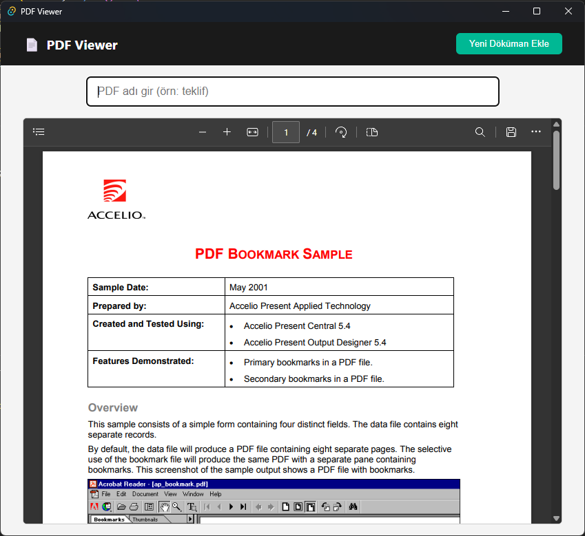

<div align="center">
  
  <h1>PdfViewer</h1>
</div>

<p align="center">
  
  
  
  
  
  
</p>

---

## 📦 What is PDF Viewer?

**PDF Viewer** is a simple desktop application that lets users view and store PDF documents locally in a structured directory. Built using Tauri, it provides a native feel across Windows and Linux platforms with minimal system footprint.

---



---

## 🧰 Technologies Used

| Technology      | Purpose                      |
| --------------- | ---------------------------- |
| Tauri 2.0       | Cross-platform desktop shell |
| TypeScript      | UI logic                     |
| Vite            | Frontend bundler             |
| Rust            | Backend commands & I/O       |
| @tauri-apps/api | Dialog & filesystem access   |

---

## 🚀 Getting Started

### ✅ Prerequisites

- Node.js >= 18
- Rust toolchain (cargo)
- Tauri CLI (run cargo install create-tauri-app)

---

## 🚀 Project Structure

```plaintext
📁 PdfViewer
|
├── 📁 src/                    → Frontend (HTML/TS)
├── 📁 src-tauri/              → Tauri backend (Rust)
|   ├── main.rs             → Command handlers
|   └── tauri.conf.json     → App config & bundling
```

## 📅 Run Locally

```bash
# Clone the repo
git clone https://github.com/taberkkaya/PdfViewer.git
cd PdfViewer

# Install dependencies
npm install

# Start dev server (Vite + Tauri)
npm run tauri dev
```

## 🏠 Build Setup Files

You can generate platform-specific installers:

### **Windows Setup (.msi)**

```bash
npm run tauri build
# Output: src-tauri/target/release/bundle/msi/PDF_Viewer_1.0.0_x64_en-US.msi
```

### **Linux Setup (.deb)**

```bash
npm run tauri build
# Output: src-tauri/target/release/bundle/deb/expert-pdf-viewer_1.0.0_amd64.deb
```

> Note: On Linux, you must have dpkg, libwebkit2gtk, and other Tauri prerequisites installed.

## ✨ Contribution

Fork this repository and open a PR to contribute new features, improvements, or bugfixes!

<p align="center">
  
</p>
